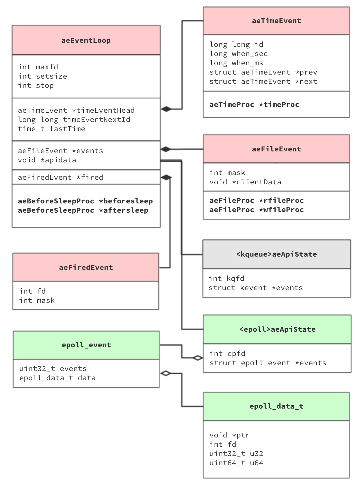
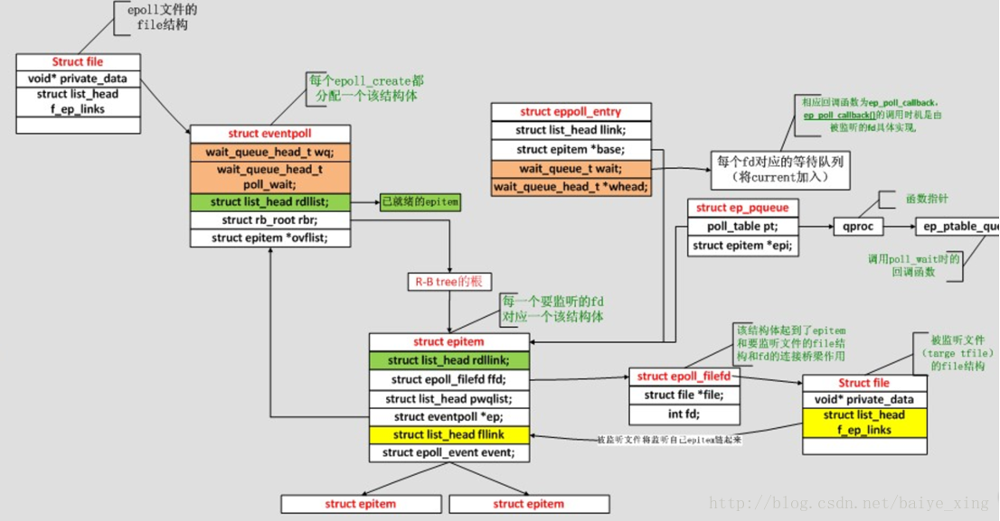

redis的事件处理器和网络框架
===

常见的服务端模型：
---
    1.单进程单线程 redis
    2.单进程多线程 memcached
    2.多进程单线程 nginx

为什么单进程单线程的redis可以那么快。
redis是纯内存kv数据库，存储和获取数据都是内存操作。
瓶颈主是网络IO开销。那么redis是怎么设计的呢？

网络IO模型
---
首先我们来看看目前有那些常见的网络IO模型：
- 同步模型（synchronous I/O）
- 阻塞IO（bloking I/O）
- 非阻塞IO（non-blocking I/O）
- 多路复用IO（multiplexing I/O）
  - select poll epoll kqueue
- 信号驱动式IO（signal-driven I/O）
  - SIGIO，不常见
- 异步IO（asynchronous I/O）
  - POSIX的aio系列函数，IOCP（Windows I/O Completion Ports，IOCP on AIX 5 and 6）
信号驱动式IO 看上去像是异步IO，但是

类比python中的网络IO
---
 - djando，flash是阻塞IO
 - tornado的ioloop是非阻塞IO。不同版本的tornado具体是实现存在差异。Python3.4加入的asyncio大大改善了Python的异步编程。
    从底层封装了非阻塞IO库，并提供友好上层方法。使得Python迸发出新的活力。
        1. On Python 3, `IOLoop` is a wrapper around the `asyncio` event loop.
            ayncio则是调用`Lib/Selector` A selector can use various implementations (select(), poll(), epoll()...) depending on the platform.
        2. On Python 2, it uses ``epoll`` (Linux) or ``kqueue`` (BSD and Mac OS X) if they are available, or else we fall back on select().
 - uvloop 基于libuv的非阻塞IO库。libevent，libev，libuv的关系

类比java中的网络IO
---
 - blocking I/O 就是阻塞IO，多线程版本。
 - NIO是非阻塞IO，同时实现了Reactor模式（即多路复用IO)
    1. NIO会将数据准备好后，再交由应用进行处理，数据的读取/写入过程依然在应用线程中完成，只是将等待的时间剥离到单独的线程中去。
    2. 节省数据准备时间（因为Selector可以复用）
 - AIO 的Proactor模式，则是异步IO
    1. 读完了再通知我
    2. 不会加快IO，只是在读完后进行通知
    3. 使用回调函数，进行业务处理

Redis的单线程特性
---
Redis 主要使用单线程设计。 这意味着单个进程使用称为多路复用的技术为所有客户端请求提供服务。 这意味着Redis可以在每个给定时刻提供单个请求，因此所有请求都按顺序提供。 这与Node.js的工作方式非常相似。 但是，这两种产品通常都不会被认为是缓慢的。 这部分是由于完成单个请求所花费的时间很少，但主要是因为这些产品被设计为不阻止系统调用，例如从套接字读取数据或向套接字写入数据。
我说Redis 主要是单线程的，因为实际上来自Redis 2.4我们在Redis中使用线程以便在后台执行一些缓慢的I / O操作，主要与磁盘I / O相关，但这并没有改变Redis服务的事实使用单个线程的所有请求。

事件相关代码：

    ae.c
    ae_epoll.c
    ae_evport.c
    ae_kqueue.c
    ae_select.c

epoll 相关的接口:
---
linux系统头文件/usr/include/sys/epoll.h 中就可以看到epoll的定义。

    typedef union epoll_data
    {
      void *ptr;
      int fd;
      uint32_t u32;
      uint64_t u64;
    } epoll_data_t;

    struct epoll_event
    {
      uint32_t events;      /* Epoll events */
      epoll_data_t data;    /* User data variable */
    } EPOLL_PACKED;

创建一个epoll实例

    extern int epoll_create(int size)
        “size”参数是指定与新实例关联的文件描述符的数量。早期版本内核会使用 size 的大小去申请对应的内存(如果在使用的时候超过了给定的size， 内核会申请更多的空间)。大于2.6.8版本，这个size参数不再使用了（内核会动态的申请需要的内存）。但要注意的是，这个size必须要大于0，为了兼容旧版的linux 内核的代码。
        epoll_create()返回的fd应该用close()关闭。
        返回新实例的fd。

注册一个epoll事件

    extern int epoll_ctl(int epfd，int op，int fd，struct epoll_event * event)
        “epfd”参数是epoll实例的fd。
        “fd”参数是操作的目标。
        “op”参数是具体的操作，取值如下：
            EPOLL_CTL_ADD 1 /* Add a file descriptor to the interface.  */
            EPOLL_CTL_DEL 2 /* Remove a file descriptor from the interface.  */
            EPOLL_CTL_MOD 3 /* Change file descriptor epoll_event structure.  */
        “event”参数描述了调用者感兴趣的事件以及任何相关的用户数据。
        成功返回0，失败特定的错误码

等待epoll事件

    extern int epoll_wait(int epfd，struct epoll_event * events，int maxevents，int timeout)
        “epfd”参数是epoll实例的fd。
        “events”参数是一个包含触发事件的缓冲区。
        “maxevents”是要返回的最大事件数（通常是“事件”的大小）。
        “timeout”参数指定最长等待时间（以毫秒为单位）（-1 ==无限）。
        返回“events”缓冲区中返回的触发事件数。如果出现错误并将“errno”变量设置为特定错误代码，则返回-1。

redis中epoll的使用
---

    ae_epoll.c

    创建epoll:
    static int aeApiCreate(aeEventLoop *eventLoop) {
        state->epfd = epoll_create(1024)
    }

    注册epoll事件
    static int aeApiAddEvent(aeEventLoop *eventLoop, int fd, int mask) {
        if (epoll_ctl(state->epfd,op,fd,&ee) == -1) return -1;
    }
    static void aeApiDelEvent(aeEventLoop *eventLoop, int fd, int delmask) {
        epoll_ctl(state->epfd,EPOLL_CTL_DEL,fd,&ee);
    }

    等待epoll事件
    static int aeApiPoll(aeEventLoop *eventLoop, struct timeval *tvp) {
        retval = epoll_wait(state->epfd,state->events,eventLoop->setsize,
    }

ae.h
---
我们先看看ae中的数据结构:

aeEventLoop 是整个事件循环的主结构体。

- 里面包含了处理文件和网络事件的aeFileEvent。
- 使用双向链表处理时间事件的aeTimeEvent。
- 存储当前需要处理的文件事件集合的aeFiredEvent。

ae.c
---
implements the Redis event loop, it's a self contained library which is simple to read and understand.

进阶
===
linux内核中epoll的实现
---
阅读linux-kernal源码中eventpoll.c的实现。

参考[【Linux深入】epoll源码的函数调用流程分析（图）](https://blog.csdn.net/baiye_xing/article/details/76360290)

外链
---
- [Python3 asyncio](https://docs.python.org/3/library/asyncio-eventloops.html)
- [IOCP](https://zh.wikipedia.org/wiki/IOCP)
- [Asynchronous I/O](https://en.wikipedia.org/wiki/Asynchronous_I/O)
- [uvloop](https://github.com/MagicStack/uvloop)
- [eventpoll.c](https://sourcegraph.com/github.com/torvalds/linux@master/-/blob/fs/eventpoll.c)
- [IO多路复用原理剖析](https://juejin.im/post/59f9c6d66fb9a0450e75713f)
- [redis protocol](https://redis.io/topics/protocol)
