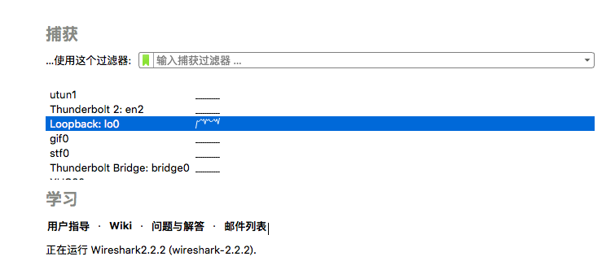
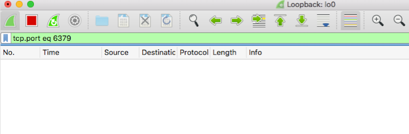
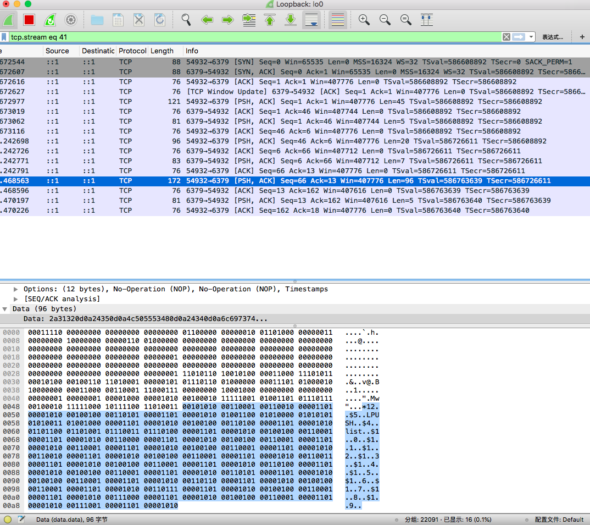
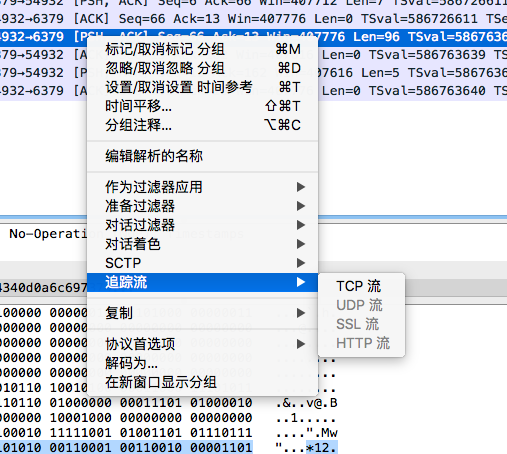
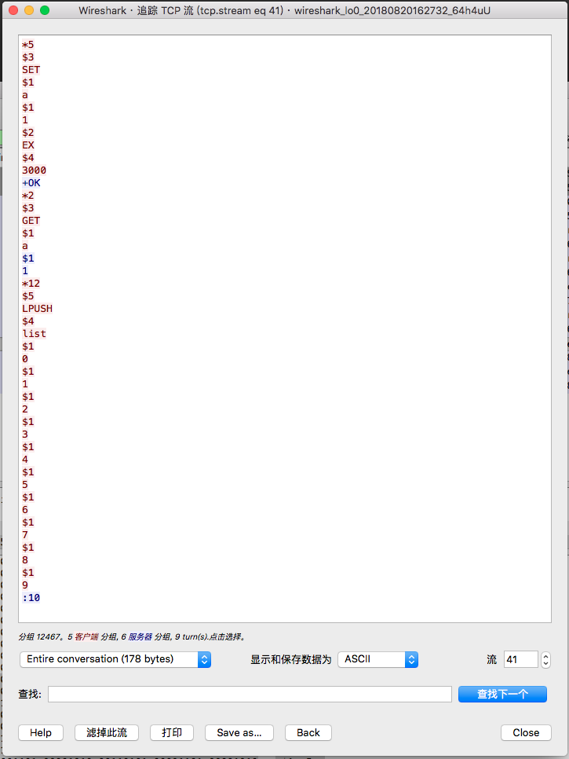

protocol
---
我们通过下面的例子来讲解redis的协议
```shell
~ λ redis-cli
127.0.0.1:6379> SET a 1 EX 3000
OK
127.0.0.1:6379> GET a
"1"
127.0.0.1:6379> LPUSH list 0 1 2 3 4 5 6 7 8 9
(integer) 10
```

我们通过wireshark 软件抓包。
启动：`sudo wireshark`
选择`lo`(127.0.0.1)，回车确认


输入过滤器 tcp.port=6379


执行redis 命令


查看 tcp 流程



转成utf8编码(没有将\r\n 换行)：

    *5\r\n$3\r\nSET\r\n$1\r\na\r\n$1\r\n1\r\n$2\r\nEX\r\n$4\r\n3000\r\n
    +OK\r\n
    *2\r\n$3\r\nGET\r\n$1\r\na\r\n
    $1\r\n1\r\n
    *12\r\n$5\r\nLPUSH\r\n$4\r\nlist\r\n$1\r\n0\r\n$1\r\n1\r\n$1\r\n2\r\n$1\r\n3\r\n$1\r\n4\r\n$1\r\n5\r\n$1\r\n6\r\n$1\r\n7\r\n$1\r\n8\r\n$1\r\n9\r\n
    :10\r\n

演示：
```python
sudo tcpdump -i lo0 port 6379 -x

python
import redis
r = redis.Redis()
r.set('a', 1, 3000)
r.get('a')
r.lpush('list', *range(10))
```
讲解：
- https://blog.csdn.net/orangleliu/article/details/50955723
- https://www.jianshu.com/p/daa3cb672470
- http://www.redis.cn/topics/protocol.html
- http://redisdoc.com/topic/protocol.html

networking.c
---
```
作者的介绍
This file defines all the I/O functions with clients, masters and slaves
(which in Redis are just special clients):

* `createClient()` allocates and initializes a new client.
* the `addReply*()` family of functions are used by commands implementations in order to append data to the client structure, that will be transmitted to the client as a reply for a given command executed.
* `writeToClient()` transmits the data pending in the output buffers to the client and is called by the *writable event handler* `sendReplyToClient()`.
* `readQueryFromClient()` is the *readable event handler* and accumulates data from read from the client into the query buffer.
* `processInputBuffer()` is the entry point in order to parse the client query buffer according to the Redis protocol. Once commands are ready to be processed, it calls `processCommand()` which is defined inside `server.c` in order to actually execute the command.
* `freeClient()` deallocates, disconnects and removes a client.

客户端调用栈
void acceptTcpHandler(aeEventLoop *el, int fd, void *privdata, int mask)
 static void acceptCommonHandler(int fd, int flags, char *ip)
  client *createClient(int fd)
   void readQueryFromClient(aeEventLoop *el, int fd, void *privdata, int mask)
    void processInputBuffer(client *c)
     int processMultibulkBuffer(client *c)
     int processInlineBuffer(client *c)
      void addReply(client *c, robj *obj)
  int writeToClient(int fd, client *c, int handler_installed)
  void freeClient(client *c)
```